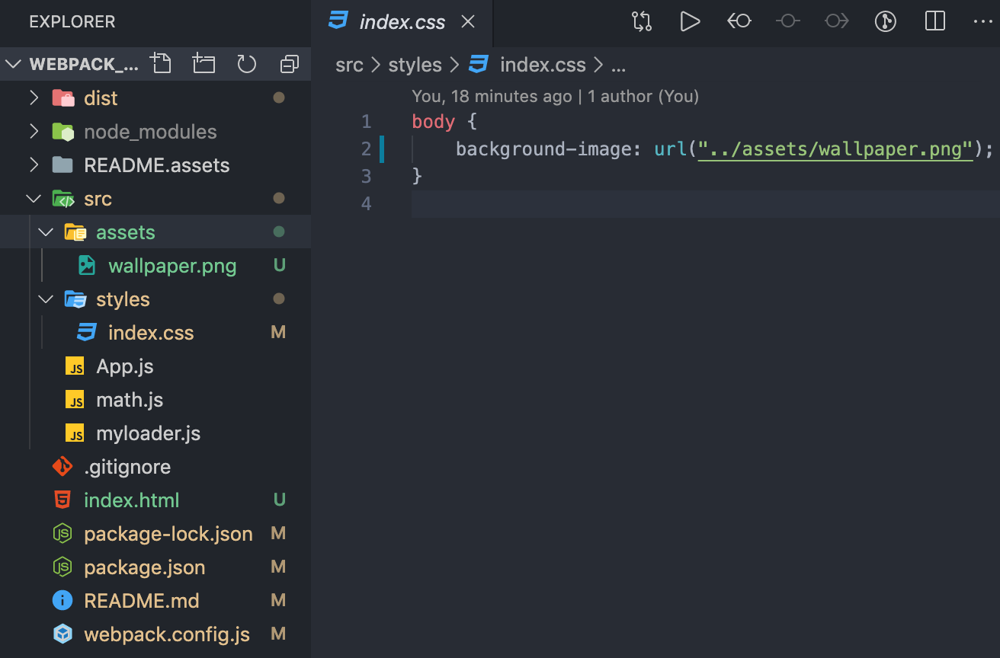
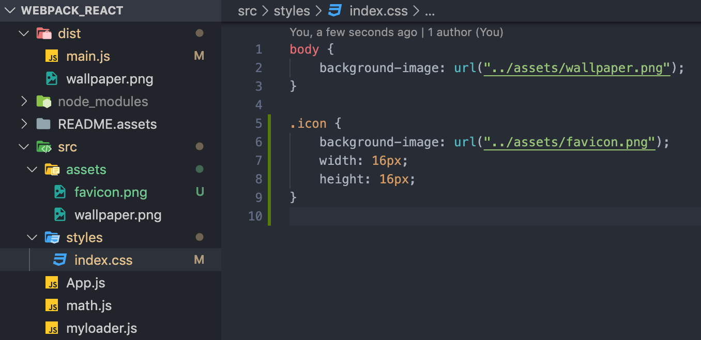
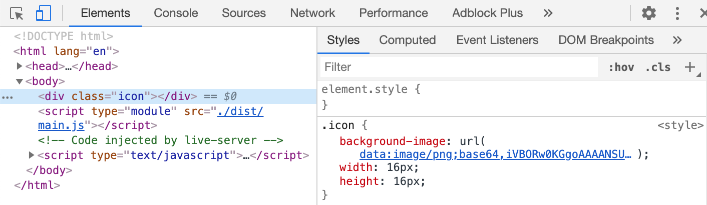
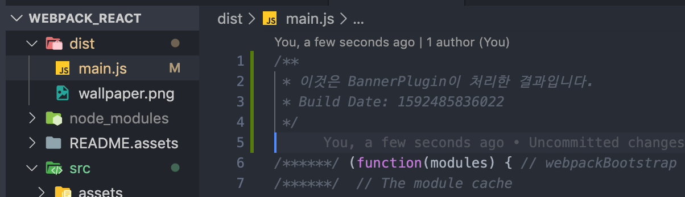
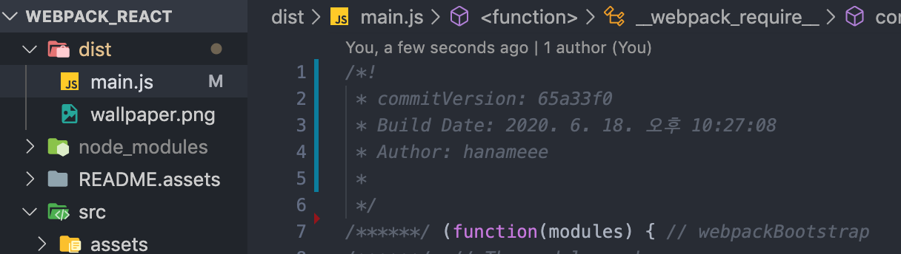

<div align="center">
  <h1>webpack-react 👋</h1>
<p>CRA 없이 만들어보며 React 개발환경 이해하기</p>
  <p>
    참고 튜토리얼: 김정환 님의 <a href="https://github.com/jeonghwan-kim/lecture-frontend-dev-env/tree/1-webpack/3-plugin">프론트엔드 개발 환경의 이해</a>
  </p>
</div>


## 1. 프로젝트 초기 설정

웹팩과 리액트를 사용하기 위해 필요한 라이브러리를 설치해보자.

```shell
$ npm init -y
```

위 명령어로 개발 프로젝트를 생성할 수 있다.

패키지 이름, 버전 등 프로젝트와 관련된 정보들을 답변하거나, 빈칸으로 두어 기본값을 입력할 수 있다. 모두 기본값을 사용할 것이라면 `-y` 플래그를 붙여 질문을 스킵하고 **package.json** 파일을 생성할 수 있다.


## 2. Webpack 설정

### 2-1. Webpack 이란?

웹팩은 여러개의 파일을 하나로 합쳐주는 **모듈 번들러**이다. 하나의 시작점 (entry point) 으로부터 의존적인 모듈을 전부 찾아내 하나의 결과물을 만들어낸다.

webpack 패키지와 웹팩 커맨드 라인 인터페이스인 webpack-cli 를 설치하자.

```shell
$ npm install -D webpack webpack-cli
```

`-D`  플래그는 개발 단계에서만 사용하기에 devDependencies 에 추가함을 의미한다.

### 2-2. Webpack 설정하기

Webpack에서 3가지 옵션만 사용하면 코드를 번들링 할 수 있다.

- `--mode` : 웹팩 실행 모드를 지정한다. production은 최적화되어 빌드되는 특징이, development는 (최적화 없이) 빠르게 빌드되는 특징이 있다.
- `--entry` : 어플리케이션 진입점 경로를 지정한다. entry에 명시한 파일 기준으로 모든 dependency를 찾아 하나의 파일로 합치게 된다
- `--output` : 웹팩에서 빌드를 완료하면 output에 있는 정보를 통해 빌드 파일을 생성한다


개발할 때마다 터미널에 `--mode`, `--entry`, `--output` 옵션을 사용해 번들링 할 수도 있지만, 웹팩 설정파일인 **webpack.config.json** 에 옵션을 작성하는 것이 좋다.

> webpack.config.js

```js
const path = require('path');

module.exports = {
  mode: 'development',
  entry: {
    main: './src/app.js'
  },
  output: {
    // [name] 에는 entry에 추가한 main이 문자열로 들어간다
    filename: '[name].js',
    //절대 경로를 사용하므로 노드 코어 모듈인 path의 resolve() 함수를 사용해 계산한다
    path: path.resolve('./dist'),
  },
}
```


웹팩 실행을 위한 npm 커스텀 명령어를 추가해보자.

> package.json
```json
{
  "scripts": {
    "build": "webpack"
  }
}
```
모든 옵션을 웹팩 설정파일로 옮겼으므로, 이제 `npm run build` 명령어를 통해 간단히 웹팩 작업을 지시할 수 있다.

### 2-3. Loader

#### 2-3-1. 로더 기본 개념과 사용법

웹팩은 기본적으로 자바스크립트와 JSON 만 빌드할 수 있다. 로더는 웹팩이 자바스크립트 파일이 아닌 파일들을도 (CSS, 이미지, 폰트 등...) 이해하고 모듈로 관리할 수 있게 해준다.

로더를 사용하기 위해선, 필요에 맞는 로더를 설치한 후  `module` 과 `rules` 키워드를 사용해 웹팩 설정 파일에 정의하면 된다. 기본적인 틀은 아래와 같다.

> webpack.config.js

```js
module.exports = {
  (생략)
  module: {
    rules: [
      {
        test: '파일명 또는 가지고올 파일 패턴 정규식',
        use: ['사용할 로더의 이름']
      }
    ]
  }
}
```

- test에는 로더를 적용할 파일을 지정한다.
- use에는 test에서 지정한 파일들에 적용할 로더를 설정한다.

특정 파일에 대해 여러 개의 로더를 사용하는 경우, 배열에 여러개의 로더를 넣을 수도 있는데 이 때 로더가 **오른쪽에서 왼쪽 순으로 사용**됨을 주의해야 한다.
```js
module: {
  rules: [
    {
      test: /\.scss$/,
      use: ['css-loader', 'sass-loader'] // sass 전처리기 사용 후 css 로더 사용
    }
  ]
}
```
로더는 아래와 같이 옵션을 포함한 형태로도 입력할 수 있다
```js

module : {
	rules: {
		test: '파일명 또는 가지고올 파일 패턴 정규식',
		use: [
			{
				loader: '사용할 로더 이름',
				options: { 사용할 로더 옵션 }
			}
		]
	}
}
```

#### 2-3-2. 커스텀 로더 만들기

동작 원리를 이해하기 위해 커스텀 로더를 만들어보자.

일단 아래와 같이 디렉토리를 구성한다.


math.js에서는 간단한 덧셈 함수를 export 하고, App.js에서는 이 math.js를 import 해온 후 덧셈 함수 실행의 결과를 콘솔에 찍는다.

> math.js
```js
export const sum = (a, b) => a + b;
```

> App.js
```js
import * as math from "./math.js";

console.log(math.sum(1, 2));
```

> index.html
```html
<!DOCTYPE html>
<html lang="en">
    <head>
        <meta charset="UTF-8" />
        <meta name="viewport" content="width=device-width, initial-scale=1.0" />
        <meta http-equiv="X-UA-Compatible" content="ie=edge" />
        <title>Webpack React</title>
    </head>
    <body>
        <script type="module" src="App.js"></script>
    </body>
</html>
```
지금 상황에서는 반드시 **script 태그에 module을 사용**해야 App.js 가 ES6 모듈 시스템(export, import)을 사용할 수 있다.


커스텀 로더는 아래와 같이 만들 수 있다.

> myloader.js
```js
module.exports = function myloader (content) {
  console.log('myloader 동작')
  return content.replace('console.log(', 'alert(');
};
```
로더가 읽은 파일의 내용이 content로 전달되고, 로더는 로그를 찍은 뒤 소스에 있는 모든 console.log를 alert 함수로 변경해 리턴한다.

> webpack.config.js

```js
const path = require("path");

module.exports = {
  	(생략)
    module: {
        rules: [
            {
                test: /\.js$/,
                use: [path.resolve("./src/myloader.js")],
            },
        ],
    },
};
```

마지막으로, 웹팩 설정파일에 위와 같이 `module` 과 `rules`  키워드를 통해 커스텀 로더를 설정해주면 로더를 사용할 준비가 끝난다.


로더를 적용하기 전, index.html 을 실행했을때는 App.js 를 실행하므로 console.log에 덧셈 함수 결과가 찍힌다.

하지만, 로더를 만든 후 아래와 같이 index.html 에서 빌드 된 결과코드(dist/main.js)를 실행하게끔 하면

> index.html
```html
<script type="module" src="../dist/main.js"></script>
```


만들었던 커스텀 로더로 인해 console.log가 아니라 alert 로 변경된 것을 확인할 수 있다.

#### 2-3-3. 자주 사용하는 로더 설정하기

##### (1) css-loader + style-loader

CSS를 번들링하기 위해서는 css-loader와 style-loader를 함께 사용해야 한다.

**css-loader**을 사용하면, CSS를 모듈로 변환해 import 구문을 사용해 불러올 수 있게 해준다.

```shell
$ npm install -D css-loader
```

먼저 로더를 설치한 뒤,

> webpack.config.js
```js
module.exports = {
  (생략)
  module: {
    rules: [{
      test: /\.css$/, // .css 확장자로 끝나는 모든 파일에
      use: ['css-loader'], // css-loader를 적용 (로더 이름을 문자열로 전달해도 됨) 
    }]
  }
}
```
webpack 설정에 css-loader 을 추가해준다.

이렇게 설정하고 나면, 웹팩은 entry point에서 시작해서 모듈을 검색하다가 css 파일을 찾으면 css-loader로 처리할 것이다.

그런데 CSS는 모듈로 변경한다고 (= 자바스크립트 코드로 변경된다고) 끝나는 것이 아니라, DOM에 추가되어야 한다. 이를 위해서 자바스크립트로 변경된 CSS를 동적으로 DOM에 추가해주는 **style-loader**을 사용해야 한다.

css-loader과 동일하게 style-loader을 설치한 뒤,

```shell
$ npm install -D style-loader
```

> webpack.config.js

```js
module.exports = {
  (생략)
  module: {
    rules: [{
      test: /\.css$/,
      use: ['style-loader','css-loader'],
    }]
  }
}
```

webpack 설정에 style-loader 을 추가해준다. 이 때 배열로 설정하면 **뒤에서부터 앞으로** 로더가 동작하므로, 모든 .css 확장자로 끝나는 모듈을 읽어들여 css-loader을 적용하고, 그 다음 style-loader을 적용한다.

style-loader까지 적용한 뒤 아래처럼 간단한 css 파일을 App.js에 import 해주면


import 한 CSS 파일이 성공적으로 모듈로 잘 인식되어 적용된 것을 확인할 수 있다. 

##### (2) file-loader

file-loader 을 통해 png, svg 등의 이미지를 번들링 (웹팩 아웃풋으로 옮길) 할 수 있다. 예를 들어, CSS에서 url() 함수에 이미지 파일 경로를 지정하면, 웹팩은 해당 이미지 파일을 만났을 때 file-loader을 실행시켜 아웃풋에 설정한 경로로 이미지 파일을 복사할 것이다.

적당히 asset 폴더에 png를 하나 넣어주고, css에서 그 이미지 파일을 사용해보자.



이후 file-loader 을 설치 및 설정해준다.
```shell
$ npm install -D file-loader
```

> webpack.config.js

```js
module.exports = {
  (생략)
  module: {
    rules: [{
      test: /\.png$/,
      loader: 'file-loader',
    }]
  }
}
```

그런데, 이대로 빌드를 하면 이미지를 제대로 로딩하지 못한다. 그 이유는, png를 사용하는 측에서 `../assets/wallpaper.png` 로 파일을 요청하는데 웹팩으로 빌드한 이미지 파일은 output인 dist 폴더로 이동했기 때문이다.

따라서 옵션을 조정해 **경로를 바로잡아줘야 한다**.

> webpack.config.js

```js
module.exports = {
  (생략)
  module: {
    rules: [{
      test: /\.png$/,
      loader: 'file-loader',
      options: {
        publicPath: './dist/', // prefix를 아웃풋 경로로 지정 
        name: '[name].[ext]?[hash]', // 파일명 형식 
      }
    }]
  }
}
```
**publicPath** 옵션을 통해 file-loader이 처리하는 파일을 모듈로 사용할 때 **경로 앞에 추가될 문자열을 설정**할 수 있다. publicPath를  `./dist` 로 설정해 새롭게 옮겨진 파일 경로로 수정해주자.

또한, **name** 옵션을 통해 로더가 파일을 output에 복사할 때 사용할 파일 이름을 설정할 수 있다. 기본적으로 설정된 해쉬값을 쿼리스트링으로 옮겨 파일을 요청하도록 변경하자.

이렇게 설정해주고 나면, css에서 불러온 파일이 정상적으로 동작하는 것을 확인할 수 있다.

##### (3) url-loader

사용하는 이미지 갯수가 많다면, 네트워크 리소스에 부담을 줘 성능에 영향을 줄 수 있다. 한 페이지에서 작은 이미지(아이콘 등)를 여러개 사용한다면, 이미지를 Base64로 인코딩하여 문자열 형태로 소스코드에 넣는 형식이 더 나을 수도 있다. [참고 링크 : Data URIs](https://developer.mozilla.org/ko/docs/Web/HTTP/Basics_of_HTTP/Data_URIs)

url-loader은 이런 처리를 자동화해준다. 이전 loader들과 마찬가지로, 설치와 웹팩 설정을 해보자.

```shell
$ npm install -D url-loader
```

> webpack.config.js

```js
{
  test: /\.(png|jpg|gif)$/i,
    use: [
      {
        loader: 'url-loader',
        options: {
          publicPath: './dist/', 
          name: '[name].[ext]?[hash]', 
          limit: 5000 // 5kb 미만 파일만 data url로 처리 
        },
      },
    ],
},
```

⚠️ 앞서 설정했던 file-loader 대신 url-loader 로 **변경**해주는 것임.

url-loader의 설정은 file-loader과 거의 유사하다. 마지막 limit 속성만 다른데, 이는 모듈로 사용한 파일 중 크기가 5kb 미만인 파일만 url-loader을 적용한다. 5kb 이상인 파일은 fallback 기본값으로 file-loader이 처리한다.



빌드 결과를 보면, limit 사이즈를 초과하는 wallpaper.png는 파일로 존재하고,



limit 사이즈보다 작은 favicon은 dist 파일에 존재하지 않고 data url 형태로 변환된 것을 볼 수 있다.


### 2-4. Plugin

#### 2-4-1. 플러그인 기본 개념과 사용법

앞서 알아본 로더가 파일을 해석하고 변환하는 과정에 관여했다면 (파일 단위), 플러그인은 웹팩을 통해 **번들된 결과물**의 형태를 바꾸는 과정에 관여한다. 예를 들면, 번들된 JS를 난독화하거나 특정 텍스트를 추출하는 용도로 사용한다.

플러그인은 아래와 같이 `plugins` 키워드를 통해 선언하며, 플러그인의 배열에는 **생성자 함수로 생성한 객체 인스턴스만 추가**할 수 있다.

> webpack.config.js

```js
var HtmlWebpackPlugin = require('html-webpack-plugin');

module.exports = {
  plugins: [
    new HtmlWebpackPlugin(),
    new webpack.ProgressPlugin()
  ]
}
```

#### 2-4-2. 커스텀 플러그인 만들기

동작 원리를 이해하기 위해 커스텀 플러그인을 만들어보자. [참고 링크 - 웹팩 공식 문서 Writing a Plugin](https://webpack.js.org/contribute/writing-a-plugin/)

함수로 만들었던 로더와 다르게, 플러그인은 **클래스**로 만들고 **apply 메서드**를 구현해야 한다. (함수로 만들고 prototype에 설정해주는 것도 가능한 것 같다.) 

> myplugin.js
```js
class MyPlugin {
    apply(compiler) {
        compiler.hooks.done.tap("MyPlugin", (stats) => {
            console.log("MyPlugin 실행");
        });
        compiler.hooks.emit.tap("MyPlugin", (compilation) => {
            // 번들링 된 결과물을 source 변수에 저장한다
            const source = compilation.assets["main.js"].source();
            // 번들 소스를 얻어오는 함수를 재정의한다
            compilation.assets["main.js"].source = () => {
                const banner = [
                    "/**",
                    " * 이것은 MyPlugin이 처리한 결과입니다.",
                    ` * Build Date: ${Date.now()}`,
                    " */",
                    "",
                ].join("\n");
                return banner + "\n" + source;
            };
            console.log(source);
        });
    }
}

module.exports = MyPlugin;

```
apply 메서드는 웹팩 컴파일러가 플러그인을 설치할 때 한번 실행된다. apply 메서드는 웹팩 컴파일러에 대한 참조값을  `compiler` 인자로 받아, 콜백 함수의 실행을 보장한다. 자세한 내용은 [웹팩 공식문서 - Compiler hooks](https://webpack.js.org/api/compiler-hooks/) 를 참고하자.

위 예제의 경우 웹팩 컴파일러의 done hook이 tapped 되었을 때 로그를 찍고, 배너를 추가한다.

> webpack.config.js
```js
const MyPlugin = require('./myplugin');

module.exports = {
  (생략)
  plugins: [
    new MyPlugin(),
  ]
}
```



빌드한 후 결과물을 확인해보면 위와 같이 번들 결과물에 배너가 추가된 것을 볼 수 있다.

#### 2-4-3. 자주 사용하는 플러그인 설정하기

##### (1) BannerPlugin

위에서 설정해본 커스텀 플러그인과 유사한 것이 BannerPlugin 이다. 빌드 결과에 여러 정보를 추가할 수 있다.

플러그인 생성자 함수에 전달하는 객체의 banner 속성 값으로 문자열을 전달하거나, 웹팩 컴파일 타임에 얻을 수 있는 정보 (ex. 빌드 시간) 를 전달하기 위해 함수로 전달할 수도 있다.

> webpack.config.js

```js
const webpack = require('webpack');

module.exports = {
  plugins: [
    new webpack.BannerPlugin({
      // banner: '배너입니다',
      banner: () => `빌드 날짜: ${new Date().toLocaleString()}`
    })
  ]
```

배너 정보가 많을 시, 별도 파일로 분리하는 것이 좋다.

> banner.js
```js
const childProcess = require('child_process');

module.exports = function banner() {
  const commit = childProcess.execSync('git rev-parse --short HEAD')
  const user = childProcess.execSync('git config user.name')
  const date = new Date().toLocaleString();
  
  return (
    `commitVersion: ${commit}` +
    `Build Date: ${date}\n` +
    `Author: ${user}`
  );
}
```

banner정보를 별도의 파일로 분리하여 빌드 날짜와 커밋 해쉬, 빌드한 유저 정보까지 추가했다. childProcess 모듈에 대한 내용은 [링크](https://mylko72.gitbooks.io/node-js/content/chapter9/chapter9_2.html) 를 참고하자.

> webpack.config.js

```js
const path = require("path");
const webpack = require("webpack");
const banner = require("./banner.js");

module.exports = {
  	(생략)
    plugins: [new webpack.BannerPlugin(banner)],
};

```

빌드한 뒤 결과물은 아래와 같다.




---

### References

[Webpack과 Babel을 이용한 React 개발 환경 구성하기](https://medium.com/wasd/웹팩-webpack-과-바벨-babel-을-이용한-react-개발-환경-구성하기-fb87d0027766)

[React 개발 환경을 구축하면서 배우는 웹팩(Webpack) 기초](https://velog.io/@jeff0720/React-개발-환경을-구축하면서-배우는-Webpack-기초))

[프론트엔드 개발환경의 이해](http://jeonghwan-kim.github.io/series/2020/01/02/frontend-dev-env-webpack-intermediate.html)

[웹팩 핸드북](https://joshua1988.github.io/webpack-guide/)

