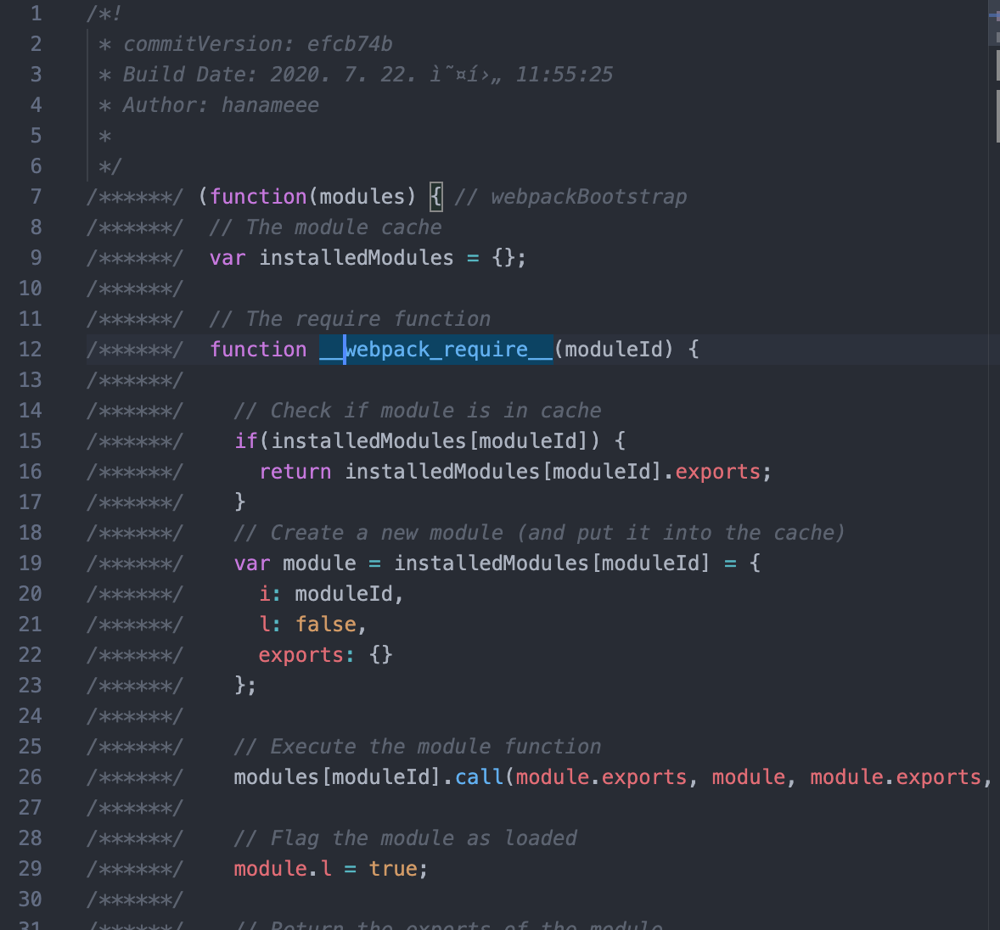
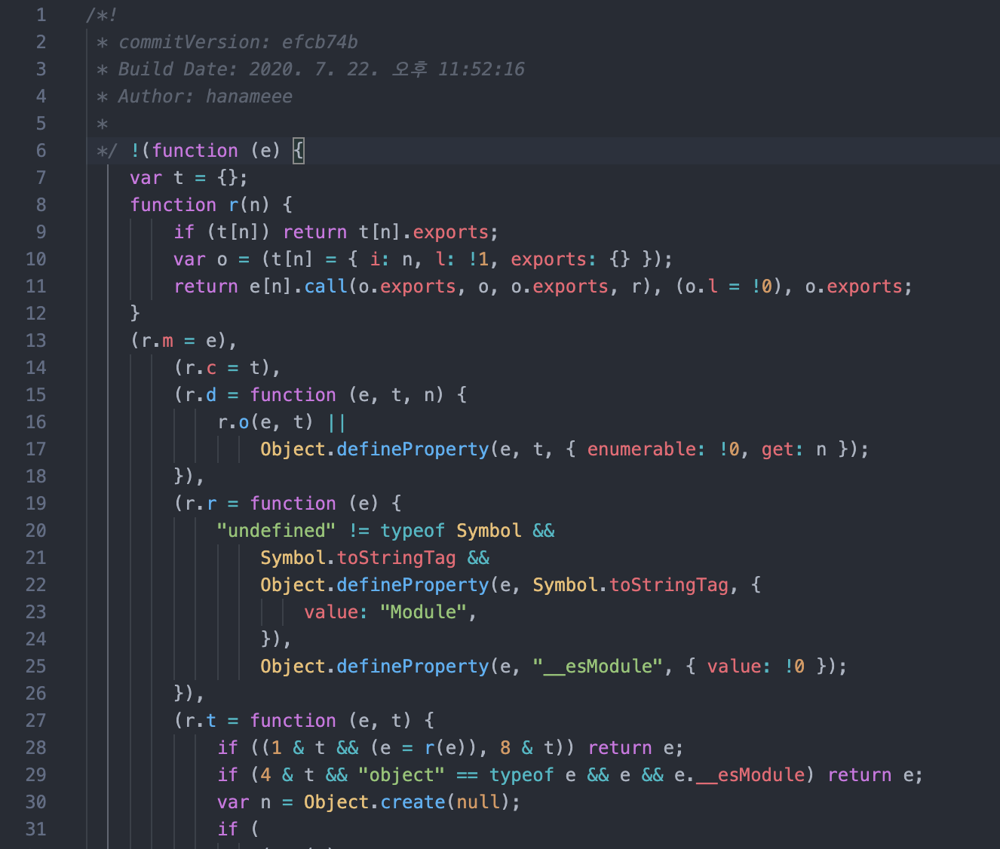

<div align="center">
  <h1>webpack-react 👋</h1>
  <p>
    참고 튜토리얼: 김정환 님의 <a href="http://jeonghwan-kim.github.io/series/2020/01/02/frontend-dev-env-webpack-intermediate.html">프론트엔드 개발 환경의 이해: 웹팩(심화)</a>
  </p>
</div>


## 3. Webpack 심화 기능

웹팩은 모듈 번들링 기능 뿐만 아니라, 프론트엔드 개발 서버를 제공하고 빌드 결과를 최적화 하는 등의 기능을 제공한다.

### 3-1. 웹팩 개발 서버

지금까지는 브라우저에서 파일을 직접 열어서 결과물을 확인했다. 그런데, 원래 브라우저 운영환경은 서버 프로그램으로 파일을 읽고, 요청한 클라이언트에게 페이지를 제공해주는 방식이다.

개발환경에서도 이와 유사한 환경을 맞춰야 배포시 잠재적 문제를 미리 확인할 수 있고, ajax 방식의 API 연동을 할 때 역시 CORS 정책으로 인해 서버가 필요하다.

[webpack-dev-server](https://webpack.js.org/configuration/dev-server/)은 프론트엔드 개발환경에서 이러한 개발용 서버를 제공해준다.

[설치]

```shell
npm i -D webpack-dev-server
```

[스크립트 추가]

> package.json

```js
{
  "scripts": {
    "start": "webpack-dev-server"
  }
}
```

이제 npm start 명령어를 실행하면 개발 서버를 구동할 수 있다.


이렇게 8080 포트에 서버가 구동된 것을 볼 수 있다. 웹팩 서버는 파일 변화를 감지하면 웹팩 빌드를 다시 수행하고, 브라우저를 새로고침하여 변경된 결과물을 보여준다.

#### 웹팩 개발 서버 기본 설정

웹팩 설정 파일의 devServer 객체에 개발 서버 [옵션](https://webpack.js.org/configuration/dev-server/)들을 설정할 수 있다.

>  webpack.config.js

```js
// webpack.config.js:
module.exports = {
  devServer: {
    contentBase: path.join(__dirname, "dist"), // 정적파일 제공할 경로. 기본값은 웹팩 아웃풋
    publicPath: "/", // 브라우저 통해 접근하는 경로. 기본값은 '/'
    host: "dev.domain.com",
    overlay: true,
    port: 8081,
    stats: "errors-only",
    historyApiFallback: true,
  }
}
```

host 의 경우 개발환경에서 도메인을 맞춰야 하는 경우 사용한다. 예를 들어, 쿠키 기반 인증은 인증 서버와 동일한 도메인으로 개발환경을 맞춰야한다. 운영체제의 호스트 파일에 해당 도메인과 127.0.0.1 (localhost) 연결을 추가한 뒤 host 속성에 도메인을 설정해서 사용한다.

### 3-2. API 연동

프론트엔드는 서버와 데이터를 주고받기 위해 ajax를 사용한다. 보통은 api 서버를 어딘가 (혹은 localhost) 띄우고 프론트 서버와 함께 개발하게 되는데, 이러한 API 서버 구성을 어떻게 하는지 알아보자.

#### 목업 API 1 - devServer.before

웹팩 개발 서버 중 before 속성을 통해 웹팩 서버에 기능을 추가할 수 있다. Node.js의 미들웨어 형태로 서버 기능을 확장할 수 있는 웹 프레임워크인 Express처럼, devServer.before에도 미들웨어를 추가할 수 있다.

> webpack.config.js

```js
// webpack.config.js
module.exports = {
  devServer: {
    before: (app, server, compiler) => {
      app.get('/api/keywords', (req,res) => {
        res.json([
          {keyword: "샤브샤브"},
          {keyword: "칼국수"},
          {keyword: "만두"}
        ])
      })
    }
  }
}
```

before에 설정한 미들웨어는 Express의 인스턴스인 **app 객체**가 인자로 전달되는데, 이 app 객체에 라우트 컨트롤러를 추가할 수 있다.

[라우트 컨트롤러 예시]

```js
// app.get(url, controller) 형식
app.get('/api/keywords', (req,res) => {
  res.json([
    {keyword: "샤브샤브"},
    {keyword: "칼국수"},
    {keyword: "만두"}
  ])
})
```

컨트롤러는 요청과 응답을 받아, res.json으로 리턴한다.

서버를 구동하고 curl로 위에서 정의한 endpoint에 http 요청을 보내면, json을 리턴한다.


이러한 기능은, 개발 초기 서버 API가 만들어지기 전, 서버 API 응답을 프론트엔드에서 구현할 때 사용할 수 있다.

기존의 구조를 리팩토링해보자.


**models** 에서는 axios로 요청을 보내 데이터를 받아온다. 앞서 devServer.before에서 추가한 라우트로 get요청을 보내 data를 받아온다.

````js
import request from "./request";

export default {
    async list() {
        const data = await request("get", "/api/keywords");
        return data;
    },
};
````

**controller** 에서는 model과 view를 import해 model로부터 data를 비동기적으로 받아온 뒤  view 해당 data를 주입해 view를 생성한다.

**view** 에서는 data를 받아 html을 동적으로 생성한다.

#### 목업 API 2 - connect-api-mocker

목업 API 갯수가 많을때는 직접 컨트롤러를 작서앟는 것 보단 connect-api-mocker을 사용해 목업 파일로 관리하면 좋다. 특정 목업 폴더를 만들어 api 응답을 담은 파일을 저장한 뒤, 이 폴더를 api로 제공해주는 기능을 한다.

```shell
npm i -D connect-api-mocker
```

>  root 경로 기준) mocks/api/keywords/GET.json

```json
[
  { "keyword": "이탈리아" }, 
  { "keyword": "세프의요리" }, 
  { "keyword": "제철" }, 
  { "keyword": "홈파티 " }
]
```

기존에 추가했던 목업 응답 컨트롤러를 제거하고, connect-api-mocker로 미들웨어를 대신한다.

> webpack.config.js

```js
const apiMocker = require('connect-api-mocker')

module.exports = {
  devServer: {
    before: (app, server, compiler) => {
      app.use(apiMocker('/api', 'mocks/api'))
    },
  }
}
```

express 객체인 app은 미들웨어 추가를 위한 범용 메소드 `use()` 를 제공한다.

`apiMocker("설정할 라우팅 경로", "응답으로 제공할 목업 파일 경로")` 이다.

#### 실제 API 연동 - devServer.proxy

목업이 아닌 실제 API 서버에 요청을 한다고 가정해보자. 아래처럼 서버 세팅을 해두고,

```bash
curl localhost:3001/api/test
[{ "keyword": "샤브샤브" }, { "keyword": "칼국수" }, { "keyword": "만두" }]
```
> src/models/KeywordModel.js

```js
import request from "./request";

export default {
    async list() {
        const data = await request("get", "http://localhost:3001/api/test");
        return data;
    },
};
```

직접 서버에 API 요청을 해보면, CORS 오류를 만날 수 있다. 같은 도메인 (localhost) 이지만, 포트번호가 다르기에 다른 Origin으로 인식되기 때문이다.

CORS 이슈 해결책은 아래 2가지가 있다. (둘 중 한가지만 해도 OK)

1) 서버 측 해결방법: 해당 API 응답 헤더에 `Access-Control-Allow-Origin: *` 헤더를 추가해준다.

> server의 API 컨트롤러

```js
app.get('/api/keywords', (req,res) => {
  res.header("Access-Control-Allow-Origin", "*");
  res.json(keywords)
})
```

2) 클라이언트 측 해결방법: webpack-dev-server에서 API 서버로 프록싱한다.

> webpack.config.js

```js
// webpack.config.js
module.exports = {
  devServer: {
    proxy: {
      '/api': 'http://localhost:3001',
    }
  }
}
```
개발서버로 들어온 모든 http 요청 중, /api 로 시작하는 것은 http://localhost:3001  로 요청하도록 프록싱 하는 것이다.
> src/models/KeywordModel.js

```js
import request from "./request";

export default {
    async list() {
      	// api endpoint를 변경해준다
        const data = await request("get", "/api/test");
        return data;
    
};
```


### 3-3. 핫 모듈 리플레이스먼트 (HMR)

[공식 문서](https://webpack.js.org/guides/hot-module-replacement/#other-code-and-frameworks)

Webpack dev server은 코드의 변화를 감지해서 전체 화면을 갱신(새로고침)한다. 그런데 SPA는 브라우저에서 state로 데이터를 관리하기 때문에 새로고침이 되면 모든 데이터가 초기화되어버리는 불편함이 있다.

HMR은 전체 화면 갱신 없이, 변경한 모듈만 변경하는 기능으로 Webpack dev server 이 제공하는 기능이다.

> webpack.config.js

```js
// webpack.config.js:
module.exports = {
  devServer = {
    hot: true,
  },
}
```

위처럼 devServer.hot 옵션을 켜면, Webpack dev server 에서Webpack dev server 객체가 생성된다. Module.hot 객체의 `accept()` 메소드는 감시할 모듈과 콜백 함수를 인자로 받는다.

```js
if (module.hot) {
  console.log('핫모듈 켜짐')
	// view 모듈을 감시하고, 해당 모듈에 변경사항이 있으면 전달한 콜백 함수가 동작한다.
  module.hot.accept('./view', () => {
    console.log('view 모듈 변경됨')
  }) 
}
```

이 콜백함수를 이용하면 화면 새로고침 없이 변경된 모듈만 아래처럼 교체할 수 있다.

```js
if (module.hot) {
  module.hot.accept('./view', async () => {
    view.render(await model.get(), controller.el); // 변경된 모듈로 교체 
  }) 
}
```

위와 같이 HMR 인터페이스를 구현한 로더만이 핫 로딩을 지원한다. 예를 들어 `style-loader` 같은 경우 내부 코드를 보면 hot.accept()  함수를 사용한 것을 알 수 있다.


### 3-4. 최적화

#### 1. production 모드

가장 기본적인 방법은 **mode 값을 설정**하는 것이다.

[development]

DefinePlugin 을 사용하면 `process.env.NODE_ENV ` 값이 "development" 으로 설정되어 어플리케이션에 전역변수로 주입된다. 

development 는 디버깅 편의를 위해 아래 두 플러그인을 사용한다.

- NamedChunksPlugin
- NamedModulesPlugin

반면, mode를 product로 설정하면 JS결과물을 최소화하기 위해 아래 7개 플러그인을 사용한다. DefinePlugin 을 사용하면 `process.env.NODE_ENV ` 값이 "production" 으로 설정되어 어플리케이션에 전역변수로 주입된다. 

- FlagDependencyUsagePlugin
- FlagIncludedChunksPlugin
- ModuleConcatenationPlugin
- NoEmitOnErrorsPlugin
- OccurrenceOrderPlugin
- SideEffectsFlagPlugin
- TerserPlugin

> webpack.config.js

```js
const mode = process.env.NODE_ENV || 'development'; // 기본값은 development

module.exports = {
  mode,
}
```

> package.json

```js
{
  "scripts": {
    "start": "webpack-dev-server --progress", // start는 개발 서버를 구동하므로 환경변수를 사용하지 않고 기본값 development를 사용하게 된다
    "build": "NODE_ENV=production webpack --progress" // 배포용 build는 환경변수를 production으로 설정했으므로 config 파일의 mode에 production이 설정된다
  }
}
```

- development mode로 빌드한 결과물



- Production mode로 빌드한 결과물



#### 2. optimization 속성

웹팩은 [optimazation](https://webpack.js.org/configuration/optimization/) 속성을 통해 빌드 과정에서 최적화를 커스터마이징 할 수 있다.

```bash
npm i -D optimize-css-assets-webpack-plugin
```

> Webpack.config.js

```js
const OptimizeCSSAssetsPlugin = require('optimize-css-assets-webpack-plugin');

module.exports = {
  optimization: {
    minimizer: mode === 'production' ? [
      new OptimizeCSSAssetsPlugin(),
    ] : [],
  },
}
```

webpack의 `optimization.minimizer` 속성에는 빌드하는 과정에서 **결과물을 압축할 때 사용할 플러그인**을 배열로 넣을 수 있다.

[optimize-css-assets-webpack-plugin](https://webpack.js.org/plugins/mini-css-extract-plugin/#minimizing-for-production) 는 css를 압축하는데, 이 플러그인을 설치 후 위처럼 config에 설정해주면 production 모드에서 빌드 시 css 파일이 압축된다. (빈칸 없어짐)

그 외에도 자바스크립트 코드를 난독화하고 debugger 구문을 제거하는 [TerserWebpackPlugin](https://webpack.js.org/plugins/terser-webpack-plugin/) 등의 minimizer 또한 존재한다. 기본 설정 외에도 콘솔 로그를 제거하는 등의 옵션도 있다.

```bash
npm i -D terser-webpack-plugin
```

> webpack.config.js

```js
const TerserPlugin = require('terser-webpack-plugin');

module.exports = {
  optimization: {
    minimizer: mode === 'production' ? [
      new TerserPlugin({
        terserOptions: {
          compress: {
            drop_console: true, // 콘솔 로그 제거
          }
        }
      }),
    ] : [],
  },
}
```

